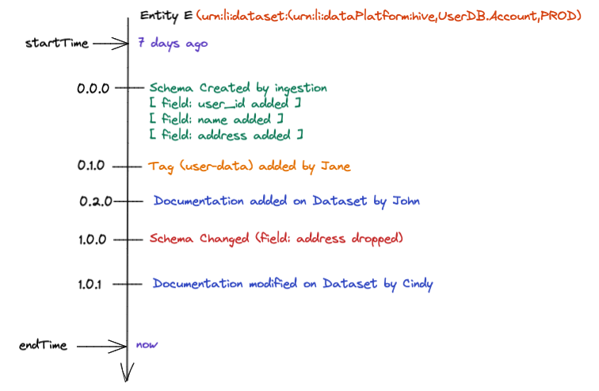
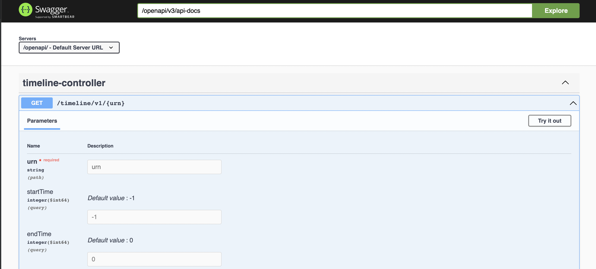

The Timeline API supports viewing version history of schemas, documentation, tags, glossary terms, and other updates
to entities. At present, the API only supports Datasets. 

## Compatibility

The Timeline API is available in server versions `0.8.28` and higher. The `cli` timeline command is available in [pypi](https://pypi.org/project/acryl-datahub/) versions `0.8.27.1` onwards.

# Concepts

## Entity Timeline Conceptually
For the visually inclined, here is a conceptual diagram that illustrates how to think about the entity timeline with categorical changes overlaid on it.



## Change Event
Each modification is modeled as a 
[ChangeEvent](../../metadata-io/src/main/java/com/linkedin/metadata/timeline/data/ChangeEvent.java)
which are grouped under [ChangeTransactions](../../metadata-io/src/main/java/com/linkedin/metadata/timeline/data/ChangeTransaction.java) 
based on timestamp. A `ChangeEvent` consists of:

- `changeType`: An operational type for the change, either `ADD`, `MODIFY`, or `REMOVE`
- `semVerChange`: A [semver](https://semver.org/) change type based on the compatibility of the change. This gets utilized in the computation of the transaction level version. Options are `NONE`, `PATCH`, `MINOR`, `MAJOR`, and `EXCEPTIONAL` for cases where an exception occurred during processing, but we do not fail the entire change calculation
- `target`: The high level target of the change. This is usually an `urn`, but can differ depending on the type of change.
- `category`: The category a change falls under, specific aspects are mapped to each category depending on the entity
- `elementId`: Optional, the ID of the element being applied to the target
- `description`: A human readable description of the change produced by the `Differ` type computing the diff
- `changeDetails`: A loose property map of additional details about the change

### Change Event Examples
- A tag was applied to a *field* of a dataset through the UI:
  - `changeType`: `ADD`
  - `target`: `urn:li:schemaField:(urn:li:dataset:(urn:li:dataPlatform:<platform>,<name>,<fabric_type>),<fieldPath>)` -> The field the tag is being added to
  - `category`: `TAG` 
  - `elementId`: `urn:li:tag:<tagName>` -> The ID of the tag being added
  - `semVerChange`: `MINOR`
- A tag was added directly at the top-level to a dataset through the UI:
  - `changeType`: `ADD`
  - `target`: `urn:li:dataset:(urn:li:dataPlatform:<platform>,<name>,<fabric_type>)` -> The dataset the tag is being added to
  - `category`: `TAG`
  - `elementId`: `urn:li:tag:<tagName>` -> The ID of the tag being added
  - `semVerChange`: `MINOR`

Note the `target` and `elementId` fields in the examples above to familiarize yourself with the semantics.

## Change Transaction
Each `ChangeTransaction` is assigned a computed semantic version based on the `ChangeEvents` that occurred within it,
starting at `0.0.0` and updating based on whether the most significant change in the transaction is a `MAJOR`, `MINOR`, or 
`PATCH` change. The logic for what changes constitute a Major, Minor or Patch change are encoded in the category specific `Differ` implementation. 
For example, the [SchemaDiffer](../../metadata-io/src/main/java/com/linkedin/metadata/timeline/differ/SchemaDiffer.java) has baked-in logic for determining what level of semantic change an event is based on backwards and forwards incompatibility. Read on to learn about the different categories of changes, and how semantic changes are interpreted in each.

# Categories
ChangeTransactions contain a `category` that represents a kind of change that happened. The `Timeline API` allows the caller to specify which categories of changes they are interested in. Categories allow us to abstract away the low-level technical change that happened in the metadata (e.g. the `schemaMetadata` aspect changed) to a high-level semantic change that happened in the metadata (e.g. the `Technical Schema` of the dataset changed). Read on to learn about the different categories that are supported today.

The Dataset entity currently supports the following categories:

## Technical Schema

- Any structural changes in the technical schema of the dataset, such as adding, dropping, renaming columns. 
- Driven by the `schemaMetadata` aspect. 
- Changes are marked with the appropriate semantic version marker based on well-understood rules for backwards and forwards compatibility.

**_NOTE_**: Changes in field descriptions are not communicated via this category, use the Documentation category for that.

### Example Usage

We have provided some example scripts that demonstrate making changes to an aspect within each category and use then use the Timeline API to query the result.
All examples can be found in [smoke-test/test_resources/timeline](../../smoke-test/test_resources/timeline) and should be executed from that directory.
```console
% ./test_timeline_schema.sh
[2022-02-24 15:31:52,617] INFO     {datahub.cli.delete_cli:130} - DataHub configured with http://localhost:8080
Successfully deleted urn:li:dataset:(urn:li:dataPlatform:hive,testTimelineDataset,PROD). 6 rows deleted
Took 1.077 seconds to hard delete 6 rows for 1 entities
Update succeeded with status 200
Update succeeded with status 200
Update succeeded with status 200
http://localhost:8080/openapi/timeline/v1/urn%3Ali%3Adataset%3A%28urn%3Ali%3AdataPlatform%3Ahive%2CtestTimelineDataset%2CPROD%29?categories=TECHNICAL_SCHEMA&start=1644874316591&end=2682397800000
2022-02-24 15:31:53 - 0.0.0-computed
	ADD TECHNICAL_SCHEMA dataset:hive:testTimelineDataset (field:property_id): A forwards & backwards compatible change due to the newly added field 'property_id'.
	ADD TECHNICAL_SCHEMA dataset:hive:testTimelineDataset (field:service): A forwards & backwards compatible change due to the newly added field 'service'.
	ADD TECHNICAL_SCHEMA dataset:hive:testTimelineDataset (field:service.type): A forwards & backwards compatible change due to the newly added field 'service.type'.
	ADD TECHNICAL_SCHEMA dataset:hive:testTimelineDataset (field:service.provider): A forwards & backwards compatible change due to the newly added field 'service.provider'.
	ADD TECHNICAL_SCHEMA dataset:hive:testTimelineDataset (field:service.provider.name): A forwards & backwards compatible change due to the newly added field 'service.provider.name'.
	ADD TECHNICAL_SCHEMA dataset:hive:testTimelineDataset (field:service.provider.id): A forwards & backwards compatible change due to the newly added field 'service.provider.id'.
2022-02-24 15:31:55 - 1.0.0-computed
	MODIFY TECHNICAL_SCHEMA dataset:hive:testTimelineDataset (field:service.provider.name): A backwards incompatible change due to  native datatype of the field 'service.provider.id' changed from 'varchar(50)' to 'tinyint'.
	MODIFY TECHNICAL_SCHEMA dataset:hive:testTimelineDataset (field:service.provider.id): A forwards compatible change due to field name changed from 'service.provider.id' to 'service.provider.id2'
2022-02-24 15:31:55 - 2.0.0-computed
	MODIFY TECHNICAL_SCHEMA dataset:hive:testTimelineDataset (field:service.provider.id): A backwards incompatible change due to  native datatype of the field 'service.provider.name' changed from 'tinyint' to 'varchar(50)'.
	MODIFY TECHNICAL_SCHEMA dataset:hive:testTimelineDataset (field:service.provider.id2): A forwards compatible change due to field name changed from 'service.provider.id2' to 'service.provider.id'
```

## Ownership

- Any changes in ownership of the dataset, adding an owner, or changing the type of the owner. 
- Driven by the `ownership` aspect. 
- All changes are currently marked as `MINOR`.

### Example Usage

We have provided some example scripts that demonstrate making changes to an aspect within each category and use then use the Timeline API to query the result.
All examples can be found in [smoke-test/test_resources/timeline](../../smoke-test/test_resources/timeline) and should be executed from that directory.
```console
% ./test_timeline_ownership.sh
[2022-02-24 15:40:25,367] INFO     {datahub.cli.delete_cli:130} - DataHub configured with http://localhost:8080
Successfully deleted urn:li:dataset:(urn:li:dataPlatform:hive,testTimelineDataset,PROD). 6 rows deleted
Took 1.087 seconds to hard delete 6 rows for 1 entities
Update succeeded with status 200
Update succeeded with status 200
Update succeeded with status 200
http://localhost:8080/openapi/timeline/v1/urn%3Ali%3Adataset%3A%28urn%3Ali%3AdataPlatform%3Ahive%2CtestTimelineDataset%2CPROD%29?categories=OWNERSHIP&start=1644874829027&end=2682397800000
2022-02-24 15:40:26 - 0.0.0-computed
	ADD OWNERSHIP dataset:hive:testTimelineDataset (urn:li:corpuser:datahub): A new owner 'datahub' for the dataset 'urn:li:dataset:(urn:li:dataPlatform:hive,testTimelineDataset,PROD)' has been added.
	ADD OWNERSHIP dataset:hive:testTimelineDataset (urn:li:corpuser:jdoe): A new owner 'jdoe' for the dataset 'urn:li:dataset:(urn:li:dataPlatform:hive,testTimelineDataset,PROD)' has been added.
2022-02-24 15:40:27 - 0.1.0-computed
	REMOVE OWNERSHIP dataset:hive:testTimelineDataset (urn:li:corpuser:datahub): Owner 'datahub' of the dataset 'urn:li:dataset:(urn:li:dataPlatform:hive,testTimelineDataset,PROD)' has been removed.
2022-02-24 15:40:28 - 0.2.0-computed
	ADD OWNERSHIP dataset:hive:testTimelineDataset (urn:li:corpuser:datahub): A new owner 'datahub' for the dataset 'urn:li:dataset:(urn:li:dataPlatform:hive,testTimelineDataset,PROD)' has been added.
	REMOVE OWNERSHIP dataset:hive:testTimelineDataset (urn:li:corpuser:jdoe): Owner 'jdoe' of the dataset 'urn:li:dataset:(urn:li:dataPlatform:hive,testTimelineDataset,PROD)' has been removed.
Update succeeded with status 200
Update succeeded with status 200
Update succeeded with status 200
http://localhost:8080/openapi/timeline/v1/urn%3Ali%3Adataset%3A%28urn%3Ali%3AdataPlatform%3Ahive%2CtestTimelineDataset%2CPROD%29?categories=OWNERSHIP&start=1644874831456&end=2682397800000
2022-02-24 15:40:26 - 0.0.0-computed
	ADD OWNERSHIP dataset:hive:testTimelineDataset (urn:li:corpuser:datahub): A new owner 'datahub' for the dataset 'urn:li:dataset:(urn:li:dataPlatform:hive,testTimelineDataset,PROD)' has been added.
	ADD OWNERSHIP dataset:hive:testTimelineDataset (urn:li:corpuser:jdoe): A new owner 'jdoe' for the dataset 'urn:li:dataset:(urn:li:dataPlatform:hive,testTimelineDataset,PROD)' has been added.
2022-02-24 15:40:27 - 0.1.0-computed
	REMOVE OWNERSHIP dataset:hive:testTimelineDataset (urn:li:corpuser:datahub): Owner 'datahub' of the dataset 'urn:li:dataset:(urn:li:dataPlatform:hive,testTimelineDataset,PROD)' has been removed.
2022-02-24 15:40:28 - 0.2.0-computed
	ADD OWNERSHIP dataset:hive:testTimelineDataset (urn:li:corpuser:datahub): A new owner 'datahub' for the dataset 'urn:li:dataset:(urn:li:dataPlatform:hive,testTimelineDataset,PROD)' has been added.
	REMOVE OWNERSHIP dataset:hive:testTimelineDataset (urn:li:corpuser:jdoe): Owner 'jdoe' of the dataset 'urn:li:dataset:(urn:li:dataPlatform:hive,testTimelineDataset,PROD)' has been removed.
2022-02-24 15:40:29 - 0.2.0-computed
2022-02-24 15:40:30 - 0.3.0-computed
	ADD OWNERSHIP dataset:hive:testTimelineDataset (urn:li:corpuser:jdoe): A new owner 'jdoe' for the dataset 'urn:li:dataset:(urn:li:dataPlatform:hive,testTimelineDataset,PROD)' has been added.
2022-02-24 15:40:30 - 0.4.0-computed
	MODIFY OWNERSHIP urn:li:corpuser:jdoe (DEVELOPER): The ownership type of the owner 'jdoe' changed from 'DATAOWNER' to 'DEVELOPER'.
```

## Tags

- Any changes in tags applied to the dataset or to fields of the dataset. 
- Driven by the `schemaMetadata`, `editableSchemaMetadata` and `globalTags` aspects.
- All changes are currently marked as `MINOR`.

### Example Usage

We have provided some example scripts that demonstrate making changes to an aspect within each category and use then use the Timeline API to query the result.
All examples can be found in [smoke-test/test_resources/timeline](../../smoke-test/test_resources/timeline) and should be executed from that directory.
```console
% ./test_timeline_tags.sh
[2022-02-24 15:44:04,279] INFO     {datahub.cli.delete_cli:130} - DataHub configured with http://localhost:8080
Successfully deleted urn:li:dataset:(urn:li:dataPlatform:hive,testTimelineDataset,PROD). 9 rows deleted
Took 0.626 seconds to hard delete 9 rows for 1 entities
Update succeeded with status 200
Update succeeded with status 200
Update succeeded with status 200
http://localhost:8080/openapi/timeline/v1/urn%3Ali%3Adataset%3A%28urn%3Ali%3AdataPlatform%3Ahive%2CtestTimelineDataset%2CPROD%29?categories=TAG&start=1644875047911&end=2682397800000
2022-02-24 15:44:05 - 0.0.0-computed
	ADD TAG dataset:hive:testTimelineDataset (urn:li:tag:Legacy): A new tag 'Legacy' for the entity 'urn:li:dataset:(urn:li:dataPlatform:hive,testTimelineDataset,PROD)' has been added.
2022-02-24 15:44:06 - 0.1.0-computed
	ADD TAG dataset:hive:testTimelineDataset (urn:li:tag:NeedsDocumentation): A new tag 'NeedsDocumentation' for the entity 'urn:li:dataset:(urn:li:dataPlatform:hive,testTimelineDataset,PROD)' has been added.
2022-02-24 15:44:07 - 0.2.0-computed
	REMOVE TAG dataset:hive:testTimelineDataset (urn:li:tag:Legacy): Tag 'Legacy' of the entity 'urn:li:dataset:(urn:li:dataPlatform:hive,testTimelineDataset,PROD)' has been removed.
	REMOVE TAG dataset:hive:testTimelineDataset (urn:li:tag:NeedsDocumentation): Tag 'NeedsDocumentation' of the entity 'urn:li:dataset:(urn:li:dataPlatform:hive,testTimelineDataset,PROD)' has been removed.
```

## Documentation

- Any changes to documentation at the dataset level or at the field level. 
- Driven by the `datasetProperties`, `institutionalMemory`, `schemaMetadata` and `editableSchemaMetadata`.
- Addition or removal of documentation or links is marked as `MINOR` while edits to existing documentation are marked as `PATCH` changes.

### Example Usage

We have provided some example scripts that demonstrate making changes to an aspect within each category and use then use the Timeline API to query the result.
All examples can be found in [smoke-test/test_resources/timeline](../../smoke-test/test_resources/timeline) and should be executed from that directory.
```console
% ./test_timeline_documentation.sh
[2022-02-24 15:45:53,950] INFO     {datahub.cli.delete_cli:130} - DataHub configured with http://localhost:8080
Successfully deleted urn:li:dataset:(urn:li:dataPlatform:hive,testTimelineDataset,PROD). 6 rows deleted
Took 0.578 seconds to hard delete 6 rows for 1 entities
Update succeeded with status 200
Update succeeded with status 200
Update succeeded with status 200
http://localhost:8080/openapi/timeline/v1/urn%3Ali%3Adataset%3A%28urn%3Ali%3AdataPlatform%3Ahive%2CtestTimelineDataset%2CPROD%29?categories=DOCUMENTATION&start=1644875157616&end=2682397800000
2022-02-24 15:45:55 - 0.0.0-computed
	ADD DOCUMENTATION dataset:hive:testTimelineDataset (https://www.linkedin.com): The institutionalMemory 'https://www.linkedin.com' for the dataset 'urn:li:dataset:(urn:li:dataPlatform:hive,testTimelineDataset,PROD)' has been added.
2022-02-24 15:45:56 - 0.1.0-computed
	ADD DOCUMENTATION dataset:hive:testTimelineDataset (https://www.google.com): The institutionalMemory 'https://www.google.com' for the dataset 'urn:li:dataset:(urn:li:dataPlatform:hive,testTimelineDataset,PROD)' has been added.
2022-02-24 15:45:56 - 0.2.0-computed
	ADD DOCUMENTATION dataset:hive:testTimelineDataset (https://datahubproject.io/docs): The institutionalMemory 'https://datahubproject.io/docs' for the dataset 'urn:li:dataset:(urn:li:dataPlatform:hive,testTimelineDataset,PROD)' has been added.
	ADD DOCUMENTATION dataset:hive:testTimelineDataset (https://datahubproject.io/docs): The institutionalMemory 'https://datahubproject.io/docs' for the dataset 'urn:li:dataset:(urn:li:dataPlatform:hive,testTimelineDataset,PROD)' has been added.
	REMOVE DOCUMENTATION dataset:hive:testTimelineDataset (https://www.linkedin.com): The institutionalMemory 'https://www.linkedin.com' of the dataset 'urn:li:dataset:(urn:li:dataPlatform:hive,testTimelineDataset,PROD)' has been removed.
```

## Glossary Terms

- Any changes to applied glossary terms to the dataset or to fields in the dataset. 
- Driven by the `schemaMetadata`, `editableSchemaMetadata`, `glossaryTerms` aspects.
- All changes are currently marked as `MINOR`.

### Example Usage

We have provided some example scripts that demonstrate making changes to an aspect within each category and use then use the Timeline API to query the result.
All examples can be found in [smoke-test/test_resources/timeline](../../smoke-test/test_resources/timeline) and should be executed from that directory.
```console
% ./test_timeline_glossary.sh
[2022-02-24 15:44:56,152] INFO     {datahub.cli.delete_cli:130} - DataHub configured with http://localhost:8080
Successfully deleted urn:li:dataset:(urn:li:dataPlatform:hive,testTimelineDataset,PROD). 6 rows deleted
Took 0.443 seconds to hard delete 6 rows for 1 entities
Update succeeded with status 200
Update succeeded with status 200
Update succeeded with status 200
http://localhost:8080/openapi/timeline/v1/urn%3Ali%3Adataset%3A%28urn%3Ali%3AdataPlatform%3Ahive%2CtestTimelineDataset%2CPROD%29?categories=GLOSSARY_TERM&start=1644875100605&end=2682397800000
1969-12-31 18:00:00 - 0.0.0-computed
	None None  : java.lang.NullPointerException:null
2022-02-24 15:44:58 - 0.1.0-computed
	ADD GLOSSARY_TERM dataset:hive:testTimelineDataset (urn:li:glossaryTerm:SavingsAccount): The GlossaryTerm 'SavingsAccount' for the entity 'urn:li:dataset:(urn:li:dataPlatform:hive,testTimelineDataset,PROD)' has been added.
2022-02-24 15:44:59 - 0.2.0-computed
	REMOVE GLOSSARY_TERM dataset:hive:testTimelineDataset (urn:li:glossaryTerm:CustomerAccount): The GlossaryTerm 'CustomerAccount' for the entity 'urn:li:dataset:(urn:li:dataPlatform:hive,testTimelineDataset,PROD)' has been removed.
	REMOVE GLOSSARY_TERM dataset:hive:testTimelineDataset (urn:li:glossaryTerm:SavingsAccount): The GlossaryTerm 'SavingsAccount' for the entity 'urn:li:dataset:(urn:li:dataPlatform:hive,testTimelineDataset,PROD)' has been removed.
```

# Explore the API

The API is browse-able via the UI through through the dropdown.
Here are a few screenshots showing how to navigate to it. You can try out the API and send example requests.



# Future Work

- Supporting versions as start and end parameters as part of the call to the timeline API
- Supporting entities beyond Datasets
- Adding GraphQL API support
- Supporting materialization of computed versions for entity categories (compared to the current read-time version computation)
- Support in the UI to visualize the timeline in various places (e.g. schema history, etc.)

